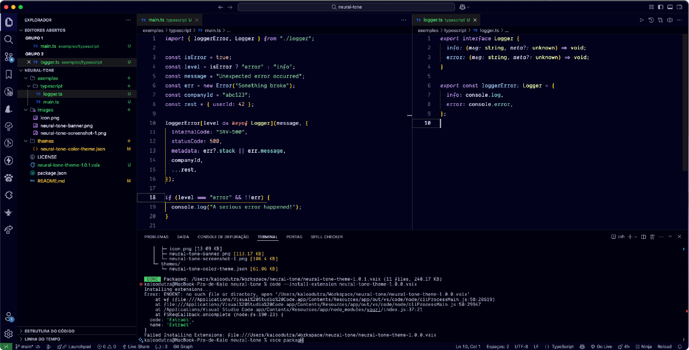

<div align="center">
  <h1>  
    NeuralTone
  </h1>
  <h6>
    🧠 A dark theme for deep focus
  </h6>
</div>

<br/>


<br/><br/>

NeuralTone Theme is a carefully crafted dark theme that blends vibrant harmony with visual comfort. Designed to stimulate focus and reduce eye strain, it's the ideal environment for developers who code deep and think deeper.

##### Support

> A dark theme for [VsCode](https://code.visualstudio.com).

NeuralTone is currently supported only for Visual Studio Code.
Community contributions to support other editors (like Atom, Sublime, or JetBrains IDEs) are very welcome!

---

## Preview



---

## Features

- Scientifically tuned color palette: dopaminergic harmony
- Vibrant yet soft tones to reduce eye strain
- Multi-language syntax support (JS, TS, Rust, Python, C++, etc.)
- Smart contrasts without visual noise

---

## Installation

### From VS Code Marketplace:

1. Open **Extensions** (`Ctrl+Shift+X` or `Cmd+Shift+X`)
2. Search for **NeuralTone Theme**
3. Click `Install`

### Manual:

```bash
vsce install neural-tone-theme.vsix
```

---

### Repository

[GitHub - NeuralTone Theme](https://github.com/kaioodutra/neural-tone-theme)

Feel free to contribute, open issues, or suggest improvements.

<br/>

### License

[MIT License](./LICENSE) © NeuralTone Theme
